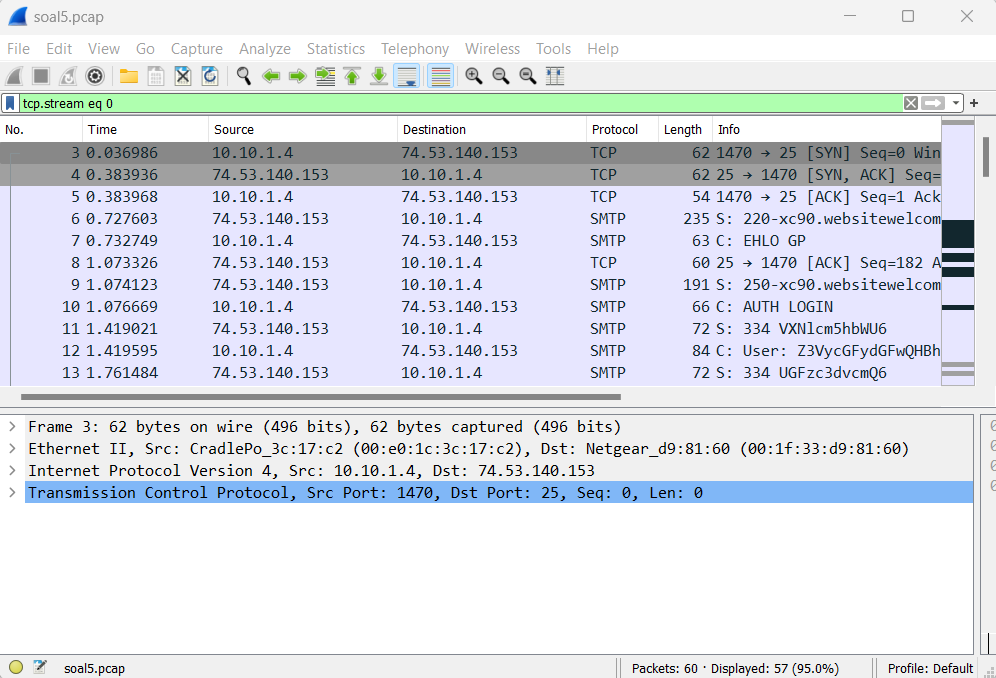
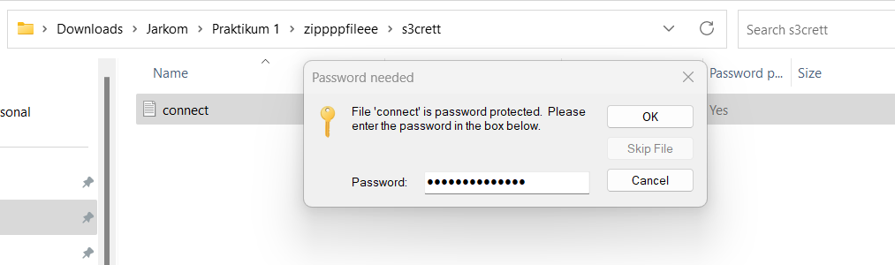
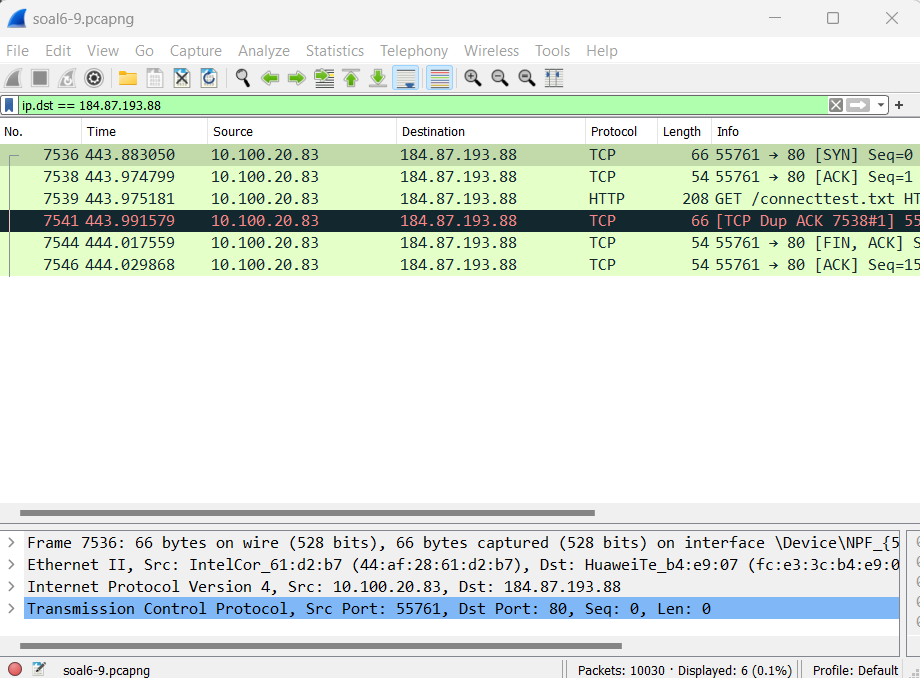

# Jarkom-Modul-1-I08-2023

Nama Anggota | NRP
------------------- | --------------		
Mardhatillah Shevy Ananti | 5025211070
Kirana Alivia Enrico | 5025211190

## List of Contents :
- [Soal 1](#soal-1)
- [Soal 2](#soal-2)
- [Soal 3](#soal-3)
- [Soal 4](#soal-4)
- [Soal 5](#soal-5)
- [Soal 6](#soal-6)
- [Soal 7](#soal-7)
- [Soal 8](#soal-8)
- [Soal 9](#soal-9)
- [Soal 10](#soal-10)

## Soal-1
User melakukan berbagai aktivitas dengan menggunakan protokol FTP. Salah satunya adalah mengunggah suatu file.
- Berapakah sequence number (raw) pada packet yang menunjukkan aktivitas tersebut? 
- Berapakah acknowledge number (raw) pada packet yang menunjukkan aktivitas tersebut? 
- Berapakah sequence number (raw) pada packet yang menunjukkan response dari aktivitas tersebut?
- Berapakah acknowledge number (raw) pada packet yang menunjukkan response dari aktivitas tersebut?

### Answer : 
- `258040667`
- `1044861039`
- `1044861039`
- `258040696`

### Explanation :
- In the display filter box at the top of Wireshark window, type the following protocol : ftp
- Find the packet that contains info of storing a zip file which is in packet 147
- Open the Transmission Control Protocol and then find the sequence number (Raw) and acknowledgment number (Raw) which are 258040667 and 1044861039

- Find the response on number 149
- Open the Transmission Control Protocol and then find the sequence number (Raw) and acknowledgment number (Raw) which are 1044861039 and 258040696

---

## Soal-2 
(REVISI) Sebutkan web server yang digunakan pada portal praktikum Jaringan Komputer!

### Answer : 
`gunicorn`

### Explanation :
- In the display filter box at the top of Wireshark window, type the following query : ip.addr == 10.21.78.111 and http
- Open the Hypertext Transfer Protocol and it will show that the server is Gunicorn

---

## Soal-3
Dapin sedang belajar analisis jaringan. Bantulah Dapin untuk mengerjakan soal berikut:
Berapa banyak paket yang tercapture dengan IP source maupun destination address adalah 239.255.255.250 dengan port 3702?
Protokol layer transport apa yang digunakan?

### Answer : 
- `21 paket`
- `UDP`

### Explanation :
- In the display filter box at the top of Wireshark window, type the following query : (ip.src == 239.255.255.250 and udp.port == 3702) or (ip.dst == 239.255.255.250 and udp.port == 3702)
- There are 21 packets that are displayed
- All of the protocol is UDP

---

## Soal-4
Berapa nilai checksum yang didapat dari header pada paket nomor 130?

### Answer : 
`0x18e5`

### Explanation :
- Find number 130
- Open User Datagram Protocol
- The checksum is 0x18e5

---

## Soal-5 
(REVISI) Elshe menemukan suatu file packet capture yang menarik. Bantulah Elshe untuk menganalisis file packet capture tersebut.
- Berapa banyak packet yang berhasil di capture dari file pcap tersebut?
- Port berapakah pada server yang digunakan untuk service SMTP?
- Dari semua alamat IP yang tercapture, IP berapakah yang merupakan public IP?

### Answer : 
- `60`
- `25`
- `74.53.140.153`

### Explanation :
- In the `Display Filter` box at the top of the Wireshark window, type the following filter: `tcp.stream eq 0`
- This filter selects and displays network packets belonging to the TCP stream with a sequence number of 0. This filter views all packets associated with the initial TCP connection setup.
- The number of packets going will be displayed at the bottom of the Wireshark window, just above the packet list. In this case, it shows 60 packets.
- Then check for the SMTP protocol data, and click on it. At the Transmission Control Protocol below, it will show the `Src port = 25`.
- Then in the Internet Protocol Version 4 section, it will show `Src = 74.53.140.153`

- Right click and go to `follow`. Then click on `TCP Stream` 

- Check for the given password to decode 

- Go to an online decoding site https://www.base64decode.org/ and decode the given password

- Then go to the zip file that contains the .txt file and insert the decoded password

- The file will open and show the instance to connect to answer this question 

---

## Soal-6 
(REVISI) Seorang anak bernama Udin Berteman dengan SlameT yang merupakan seorang penggemar film detektif. sebagai teman yang baik, Ia selalu mengajak slamet untuk bermain valoranT bersama. suatu malam, terjadi sebuah hal yang tak terdUga. ketika udin mereka membuka game tersebut, laptop udin menunjukkan sebuah field text dan Sebuah kode Invalid bertuliskan "server SOURCE ADDRESS 7812 is invalid". ketika ditelusuri di google, hasil pencarian hanya menampilkan a1 e5 u21. jiwa detektif slamet pun bergejolak. bantulah udin dan slamet untuk menemukan solusi kode error tersebut.

### Answer : 
`JDRNJA`

### Explanation :
- Combine the source IP that we found in packet 7812.

- Then, we can break it down into numbers <=26.
- From there, we can form a word from the pattern that has been discovered using a A1Z26 cipher decoder site https://planetcalc.com/4884/
- We get the result as: "JORNJA."

---

## Soal-7
Berapa jumlah packet yang menuju IP 184.87.193.88?

### Answer : 
`6`

### Explanation :
- In the `Display Filter` box at the top of the Wireshark window, type the following filter: `ip.dst == 184.87.193.88`
- This filter tells Wireshark to display only packets where the destination IP address (ip.dst) matches 184.87.193.88.
- After typing the filter, press Enter to apply the filter.
- The number of packets going to the IP address 184.87.193.88 will be displayed at the bottom of the Wireshark window, just above the packet list.

---

## Soal-8
(REVISI) Berikan kueri filter sehingga wireshark hanya mengambil semua protokol paket yang menuju port 80! (Jika terdapat lebih dari 1 port, maka urutkan sesuai dengan abjad)

### Answer : 
`tcp.dstport == 80 || udp.dstport == 80`

### Explanation :
- `tcp.dstport == 80`: This part of the filter specifies that it should match packets where the destination port (the port to which the packets are being sent) is equal to 80.
- `||` (logical OR): This operator allows you to combine multiple conditions in a filter. In this case, it means that the filter will select packets that meet either of the conditions on either side of the || operator.
- `udp.dstport == 80`: This part of the filter specifies that it should match packets where the destination port in the UDP protocol is equal to 80. While HTTP primarily uses TCP, it's possible for some applications to use UDP on port 80 as well.
  

---

## Soal-9
(REVISI) Berikan kueri filter sehingga wireshark hanya mengambil paket yang berasal dari alamat 10.51.40.1 tetapi tidak menuju ke alamat 10.39.55.34!

### Answer : 
`ip.src == 10.51.40.1 && ip.dst != 10.39.55.34`

### Explanation :
- At the top of the Wireshark window labeled "Display Filter, we typed the following query filter that requests Wireshark to display only packets with the source IP address (ip.src) of 10.51.40.1 and not the destination IP address (ip.dst) of 10.39.55.34.
- Wireshark will only display packets originating from the IP address 10.51.40.1 and not going to the IP address 10.39.55.34.
  

---

## Soal-10
(REVISI) Sebutkan kredensial yang benar ketika user mencoba login menggunakan Telnet

### Answer : 
`dhafin:kesayangannyak0k0`

### Explanation :
- In the `Display Filter` box at the top of the Wireshark window, type the following filter: `telnet`
- `telnet`: This filter in Wireshark narrows down the displayed packets to only those that contain Telnet protocol data. It essentially filters out all other types of network traffic.

- Right click and go to `follow`. Then click on `TCP Stream` 

- Go through the TCP streams, and see which login is the correct one.
- In this case, the login that works is shown as below:

---
